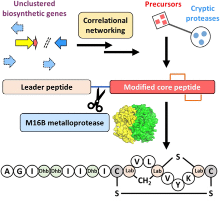

# Codes for Correlational networking guides the discovery of cryptic natural product biosynthetic enzymes

This repository is the collection of codes for our
paper: [Correlational networking guides the discovery of cryptic natural product biosynthetic enzymes](https://doi.org/10.1101/2021.07.26.453782)

## Abstract

\
Bacterial natural product biosynthetic genes, canonically clustered, have been increasingly found to rely on cryptic
enzymes encoded elsewhere in the genome for completion of biosynthesis. The study and application of lanthipeptides are
frequently hindered by cryptic proteases required for final maturation. Here, we establish a global correlation network
bridging the gap between lanthipeptide precursors and cryptic proteases. Applying our analysis to 161,954 bacterial
genomes, we establish 5,209 correlations between precursors and cryptic proteases, with 91 prioritized. We use network
predictions and co-expression analysis to reveal a previously missing protease for the maturation of class I
lanthipeptide paenilan. We further discover widely distributed bacterial M16B metallopeptidases of previously unclear
biological function as a new family of lanthipeptide proteases. We show the involvement of a pair of bifunctional M16B
proteases in the production of novel class III lanthipeptides with high substrate specificity. Together, these results
demonstrate the strength of our correlational networking approach to the discovery of cryptic lanthipeptide proteases
and potentially other missing enzymes for natural products biosynthesis.

## Dependencies

In order to run the scripts, you need to install Python 3.7+, R 3.6+, pandas and openpyxl. You could install them using
[conda](https://docs.conda.io/en/latest/miniconda.html):

    conda install R pandas openpyxl

## Pipeline

This section shows how to reproduce correlation analysis in the paper.

### Data

To reproduce the results in paper, you should download `supplementary file 1.xlsx` and `23777967_protease_cluster.csv.xz` from [Zenodo](https://doi.org/10.5281/zenodo.5162875) to the same directory
of the scripts. Then, extract the dataset by xz:

    xz -d 23777967_protease_cluster.csv.xz

### Create count matrix

Run the script `create_count_matrix.py` to prepare input matrix (require ~64 GB RAM):

    python create_count_matrix.py

This will generate a csv file `df_count.csv`

### Construct correlation network

After getting `df_count.csv`, run `spearman_network_taxonomy.R` to calculate correlations between proteases and
precursors:

    Rscript spearman_network_taxonomy.R

This will generate 5 files:

* `correlation_spearman_genus.csv` is the raw correlation result
* `Fig1_1_genus.csv` is the filtered result corresponding to Fig. 1B of the paper
* `network_spearman_genus.csv`, `node_spearman_genus.csv`, `edge_spearman_genus.csv` are network files of filtered
  result (ρ>0.3, pAdj<1E-5, I>=10) that can be visualized by [Cytoscape](https://cytoscape.org/). 

